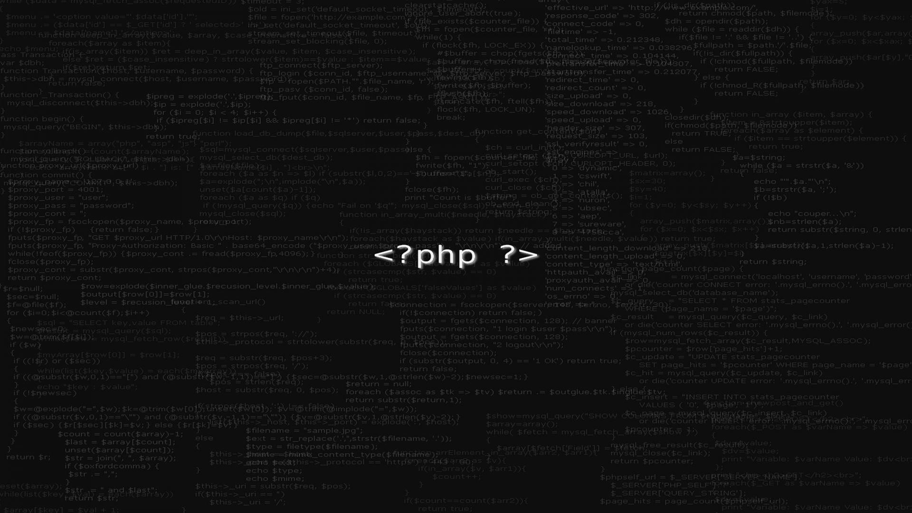

<div align="center">
  



# 🐧 Desenvolvedor FullStack & Entusiasta Linux

**`Construindo o futuro, um commit de cada vez`**

[](https://git.io/typing-svg)

</div>

---

## 🚀 Sobre Mim

```bash
$ whoami
> Adam Gabriel - Desenvolvedor FullStack & Técnico em Informática

$ echo $AGE
> 0b00010010 # 18 anos em binário! 💻

$ uname -a
> Linux cachyos 6.12.0-zen1-1-zen #1 ZEN SMP PREEMPT_DYNAMIC x86_64 GNU/Linux

$ echo $SHELL
> /bin/bash

$ cat /etc/os-release | grep PRETTY_NAME
> PRETTY_NAME="CachyOS" # I use Arch, btw! 🐧
```

- 🔭 **Atualmente trabalhando em:** Aplicações web escaláveis e microsserviços
- 🌱 **Aprendendo:** Internais avançados do kernel Linux & tecnologias Cloud Native
- 🎓 **Formação:** Técnico em Informática
- 💬 **Pergunte-me sobre:** Linux, Docker, Arquitetura Backend, ou qualquer coisa tech!
- ⚡ **Curiosidade:** Eu automatizo tudo com scripts Bash
- 🐧 **Distro Atual:** CachyOS (Arch-based) - I use Arch, btw!

---

## 🐧 Jornada Linux: Distros que já usei

### 🏆 **Favoritas (Top Tier)**


> **Por que Arch Linux?** Adoro a filosofia **DIY (Do It Yourself)** e **KISS (Keep It Simple, Stupid)**. O controle total sobre o sistema é libertador!

### ⭐ **Gosto muito**


### 📋 **Todas as distros que já experimentei:**

**🎯 Arch-based:**
- Arch Linux (❤️ a filosofia DIY/KISS)
- Manjaro
- BigLinux (❤️)
- EndeavourOS
- Arco Linux (❤️)
- Garuda Linux (⭐)

**🎯 Debian/Ubuntu-based:**
- ZorinOS (⭐)
- Linux Mint (❤️)
- Pop!_OS (⭐)

**🎯 Fedora & Atomic:**
- Fedora Workstation (❤️)
- Nobara
- **Universal Blue (UBlue) Images:**
  - Bazzite (🎮 gaming)
  - Aurora
  - Bluefin (⭐)

**❄️ NixOS:**
- NixOS (❤️ reproducible builds!)

---

## 🛠️ Stack Tecnológico

### 🎨 Frontend


### ⚙️ Backend


### 🗄️ Database


### 🐳 DevOps & Ferramentas


---

## 📊 Estatísticas GitHub

<div align="center">
  
<!-- GitHub Stats Card -->


<!-- Top Languages Card -->


</div>

<!-- GitHub Metrics (Alternativa ao Streak) -->
<div align="center">
  


</div>

<div align="center">
  
<!-- GitHub Trophy -->


</div>

---

## 📈 Atividade & Contribuições

<div align="center">
  
<!-- GitHub Activity Graph -->


</div>

<div align="center">
  
<!-- 3D Contributions -->


</div>

---

## 🐧 Meu Setup Linux

```bash
# 🖥️ Ambiente de Desenvolvimento
OS: CachyOS (Arch Linux-based)
Kernel: Linux Zen (otimizado para desktop)
Shell: Bash + Zsh com Oh-My-Zsh
Editor: Neovim / VS Code
Terminal: Alacritty / Kitty
WM: KDE Plasma / Hyprland (Wayland)

# 🛠️ Ferramentas Diárias
- Docker & Podman para containerização
- Tmux para multiplexação de terminal
- Git para controle de versão
- Paru/Yay (AUR helpers)
- Make & CMake para builds

# 🎨 Customização
- Tema: Dracula / Catppuccin
- Ícones: Papirus / Tela-circle
- Fonte: JetBrains Mono Nerd Font
```

---

## 📌 Repositórios em Destaque

<div align="center">

<a href="https://github.com/AdamGabriel1/repo1">
  
</a>
<a href="https://github.com/AdamGabriel1/repo2">
  
</a>

</div>

---

## 🌐 Conecte-se Comigo

<div align="center">

[](https://www.linkedin.com/in/adam-gabriel-b9479b2a6/)
[](mailto:adamgabriel289@gmail.com)
[](https://github.com/AdamGabriel1)

</div>

---

<div align="center">

### 💻 "Falar é fácil. Me mostre o código." - Linus Torvalds

</div>

---

<div align="center">
  

  
⭐ **Dê uma estrela nos meus repositórios se achá-los úteis!** ⭐

</div>

🌐 **Idioma/Language:** [🇧🇷 Português](./README.md) | [🇺🇸 English](./README_EN.md)
